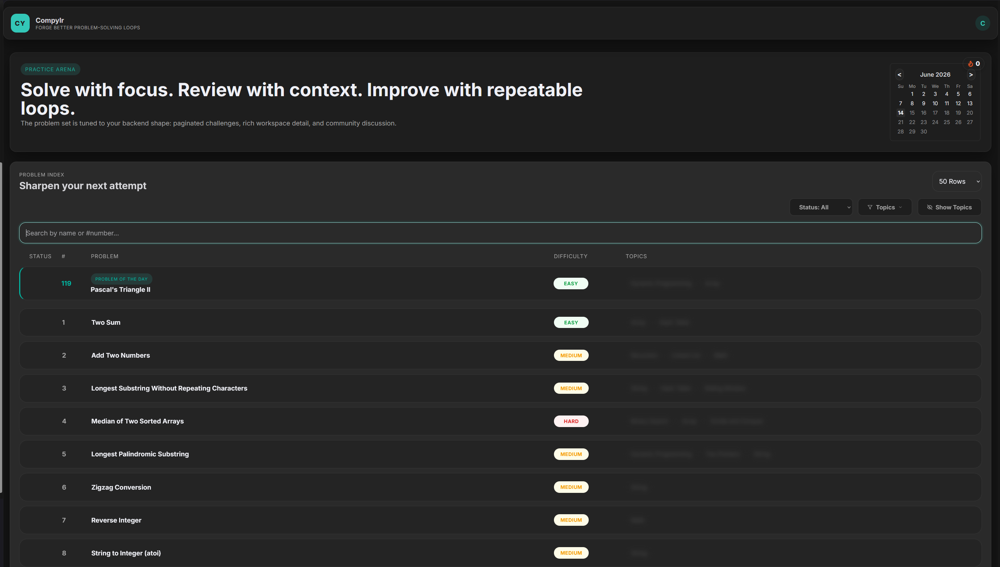
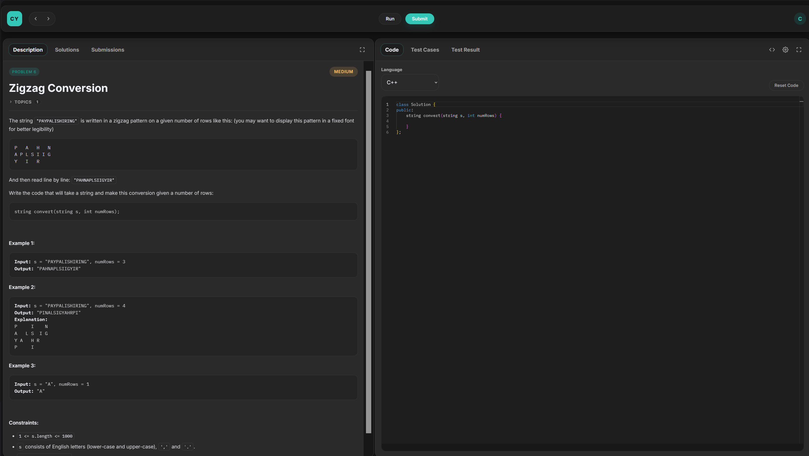
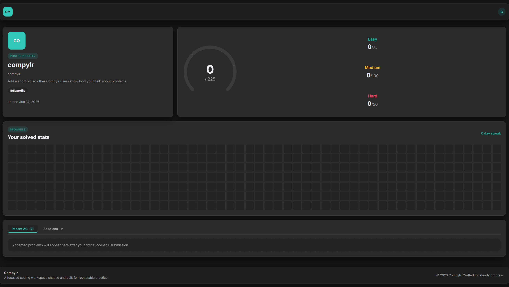
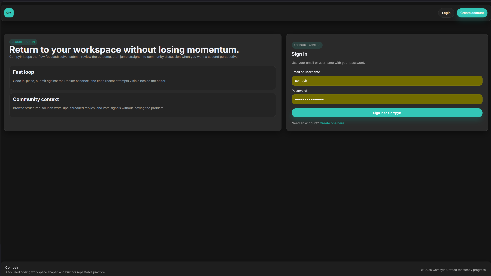

# Compylr

**A full-stack competitive programming platform** — write, run, and judge code in 5 languages, directly in your browser.

🔗 **Live:** [bit-smith-kappa.vercel.app](https://bit-smith-kappa.vercel.app) &nbsp;|&nbsp; **API:** [compylr-backend.onrender.com](https://compylr-backend.onrender.com)

---

## Screenshots

| Problems List | Problem Workspace |
|---|---|
|  |  |

| User Profile | Login |
|---|---|
|  |  |

---


## Features

- 🧑‍💻 **Multi-language judge** — Submit solutions in Python, C++23, Java, C, and C#
- 🐳 **Docker sandbox** — Every submission runs in an isolated container (no network, 512 MB RAM, 1.5 vCPU, 128 PID limit, 5-second TLE)
- ⚡ **Warm containers** — Persistent sandbox containers eliminate cold-start overhead on repeated submissions
- 📝 **Monaco Editor** — VS Code's editor engine, with per-language syntax highlighting and a resizable Golden Layout workspace
- 🔐 **JWT Auth** — Register, verify email with OTP, and log in; invite-code-gated Admin role
- 📊 **User profiles** — Solved count by difficulty, daily activity calendar, current streak
- 🧩 **225+ problems** — Auto-seeded from a curated dataset of LeetCode-style problems for learning and practice
- 💬 **Solutions & comments** — Write editorial solutions, comment, and vote
- 📅 **Problem of the Day** — Admin-configurable daily featured problem
- 🔒 **Rate limiting** — 5 req/min on auth/submit, 100 req/hr on content posting

---

## Tech Stack

| Layer | Technology |
|---|---|
| **Frontend** | Angular 20, Monaco Editor, Golden Layout, KaTeX, TailwindCSS |
| **Backend** | ASP.NET Core 8, Entity Framework Core, Npgsql |
| **Database** | PostgreSQL (Supabase) |
| **Judge Engine** | Docker (Python 3.10, GCC 13 / C++23, Eclipse Temurin 21, .NET SDK 8) |
| **Auth** | JWT (HMAC-SHA256), BCrypt, SMTP OTP |
| **Deployment** | Vercel (frontend), Render (backend), Supabase (database) |

---

## Project Structure

```
BitSmithApp/
├── angularBitSmith/        # Angular 20 SPA
│   ├── src/app/
│   │   ├── auth/           # Login, Register, OTP verification
│   │   ├── problems/       # Problem list, detail, solution editor
│   │   ├── profile/        # User profile & stats
│   │   ├── admin/          # Admin dashboard, problem creator, POTD
│   │   ├── workspace/      # Monaco + Golden Layout dockable IDE
│   │   └── services/       # HTTP services, auth guards
│   └── vercel.json
├── dotnetBitSmith/         # ASP.NET Core 8 REST API
│   ├── Controllers/        # 8 controllers (Auth, Problem, Submission, User, ...)
│   ├── Services/           # 12 services including DockerCompilationService
│   ├── Entities/           # 11 EF Core entities
│   ├── Data/               # ApplicationDbContext, indexes
│   ├── Middlewares/        # Global exception handling
│   ├── Helpers/            # ProblemSeeder
│   └── problems.json       # 2,828-problem dataset
├── docker-compose.yml      # Full local stack
└── vercel.json
```

---

## Architecture

```
Browser (Angular SPA)
        │
        ▼ HTTP / REST
ASP.NET Core 8 API
   ├── Auth (JWT + OTP)
   ├── Rate Limiter (ASP.NET Core built-in)
   ├── Problem / Solution / Comment / Vote endpoints
   ├── Submission endpoint ──► Channel<Guid> Queue (cap: 1,000)
   │                                   │
   │                    BackgroundService Worker
   │                                   │
   │                     DockerCompilationService
   │                     ┌─────────────────────────┐
   │                     │  docker exec (warm)  OR  │
   │                     │  docker run  (cold)       │
   │                     │  --network none           │
   │                     │  --memory 512m            │
   │                     │  --cpus 1.5               │
   │                     │  --pids-limit 128         │
   │                     └─────────────────────────┘
   └── IMemoryCache (1-hr TTL on problem details)
        │
        ▼
   PostgreSQL (Supabase)
```

---

## Local Development

### Prerequisites

- [.NET 8 SDK](https://dotnet.microsoft.com/download/dotnet/8)
- [Node.js 20+](https://nodejs.org/)
- [Docker Desktop](https://www.docker.com/products/docker-desktop/)
- [PostgreSQL](https://www.postgresql.org/) (or use the Docker Compose database service)

---

### 1. Clone the repo

```bash
git clone https://github.com/raftywate/BitSmith.git
cd BitSmith
```

---

### 2. Backend setup

Create `dotnetBitSmith/appsettings.Development.json` (this file is git-ignored):

```json
{
  "ConnectionStrings": {
    "connectionString": "Host=localhost;Database=BitSmithDb;Username=postgres;Password=YOUR_PG_PASSWORD"
  },
  "JwtSettings": {
    "Key": "YOUR_JWT_SECRET_MIN_32_CHARS_LONG"
  },
  "AdminSettings": {
    "InviteCode": "YOUR_ADMIN_INVITE_CODE"
  },
  "SmtpSettings": {
    "Host": "smtp.gmail.com",
    "Port": "587",
    "Username": "your@gmail.com",
    "Password": "your-gmail-app-password",
    "FromEmail": "your@gmail.com"
  }
}
```

> **Note:** For Gmail, generate an [App Password](https://myaccount.google.com/apppasswords) (requires 2FA). If SMTP is not configured, the app auto-verifies accounts as a fallback.

Start the backend:

```bash
cd dotnetBitSmith
dotnet run
```

The API starts on `http://localhost:5000`. On first run it:
1. Auto-creates all database tables
2. Seeds 225 problems (75 Easy / 100 Medium / 50 Hard) from `problems.json` if the DB is empty
3. Creates composite indexes for query performance

---

### 3. Start sandbox containers (required for code execution)

The judge engine uses Docker containers as sandboxes. Start the warm containers:

```bash
docker compose up sandbox-python sandbox-gcc sandbox-java sandbox-csharp -d
```

> Without these, submissions will fall back to cold `docker run` (slower, but still functional as long as Docker is running).

---

### 4. Frontend setup

```bash
cd angularBitSmith
npm install
npm start
```

The Angular dev server starts on `http://localhost:4200`.

> The dev environment points to `http://localhost:5000/api`. To change this, edit `src/environments/environment.ts`.

---

### 5. Full stack with Docker Compose (alternative)

To run the entire stack (database + backend + frontend + sandboxes) in Docker:

```bash
docker compose up --build
```

Access the app at `http://localhost:80`.

---

## Environment Variables (Production / Render)

Set these in your Render backend service environment:

| Variable | Description |
|---|---|
| `ConnectionStrings__connectionString` | PostgreSQL connection string (use Supabase pooler URL) |
| `JwtSettings__Key` | JWT signing secret (min 32 chars) |
| `AdminSettings__InviteCode` | Secret code that grants Admin role on registration |
| `SmtpSettings__Host` | SMTP host (e.g. `smtp.gmail.com`) |
| `SmtpSettings__Port` | SMTP port (e.g. `587`) |
| `SmtpSettings__Username` | SMTP username / email |
| `SmtpSettings__Password` | SMTP password / app password |
| `SmtpSettings__FromEmail` | From address for outgoing emails |
| `HOST_TEMP_RUNS_PATH` | Host path for temp run directories (Docker volume mount) |

---

## Seeding Problems

The app auto-seeds on startup if the database is empty. To manually trigger a full re-seed:

```bash
cd dotnetBitSmith
dotnet run -- --import-leetcode
```

This runs the full `ProblemSeeder` against `problems.json` with verbose logging.

---

## Admin Access

On the Register page, enter the configured `InviteCode` in the invite code field to create an Admin account. Admins get access to:

- `/admin` — Dashboard with stats
- `/admin/problem` — Create / edit problems with test cases
- `/admin/pod` — Set the Problem of the Day

---

## API Overview

| Method | Endpoint | Description |
|---|---|---|
| `POST` | `/api/auth/register` | Register a new user |
| `POST` | `/api/auth/login` | Login and receive JWT |
| `POST` | `/api/auth/verify-otp` | Verify email OTP |
| `GET` | `/api/problems` | Paginated problem list with filters |
| `GET` | `/api/problems/{slug}` | Problem detail with test cases |
| `POST` | `/api/submissions` | Submit a solution for judging |
| `GET` | `/api/submissions/{id}` | Poll submission result |
| `POST` | `/api/submissions/run` | Run against sample test cases |
| `POST` | `/api/submissions/run-code` | Run arbitrary code with custom stdin |
| `GET` | `/api/users/{username}` | Public user profile & stats |
| `GET` | `/api/solutions/{problemId}` | Community solutions for a problem |

Full Swagger docs available at `/swagger` when running locally.

---

## Deployment

### Frontend → Vercel

1. Connect your GitHub repo to [Vercel](https://vercel.com)
2. Set **Root Directory** to the repo root
3. Vercel uses `vercel.json` at the root to build and route the SPA

### Backend → Render

1. Create a new **Web Service** on [Render](https://render.com)
2. Set **Root Directory** to `dotnetBitSmith`
3. Use the existing `Dockerfile`
4. Set all environment variables listed above
5. Mount Docker socket if using warm containers (requires a Docker-capable host)

---

## Disclaimer

The problems included in this project are sourced from [LeetCode](https://leetcode.com) and are used purely for **educational and learning purposes**. This is a non-commercial, personal project built to practice full-stack development. All problem content, titles, and descriptions remain the intellectual property of LeetCode. If you are the rights holder and have concerns, please open an issue.

---

## License

MIT

---

<p align="center">Built by <a href="https://github.com/raftywate">@raftywate</a></p>
